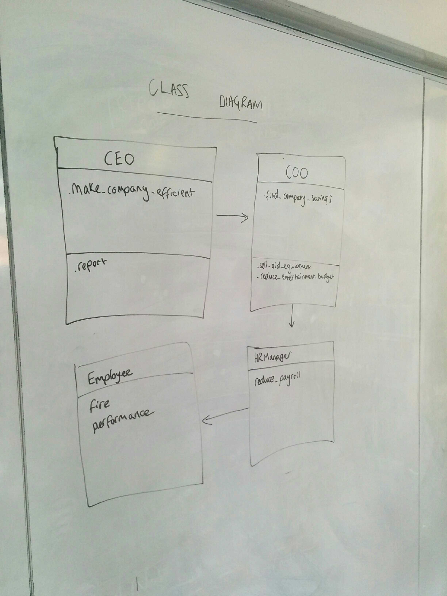
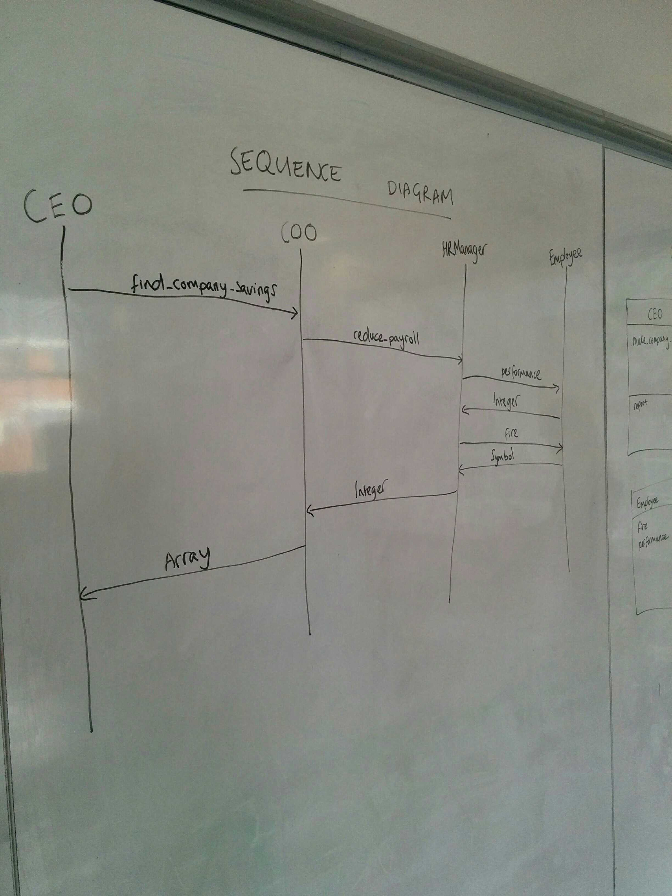
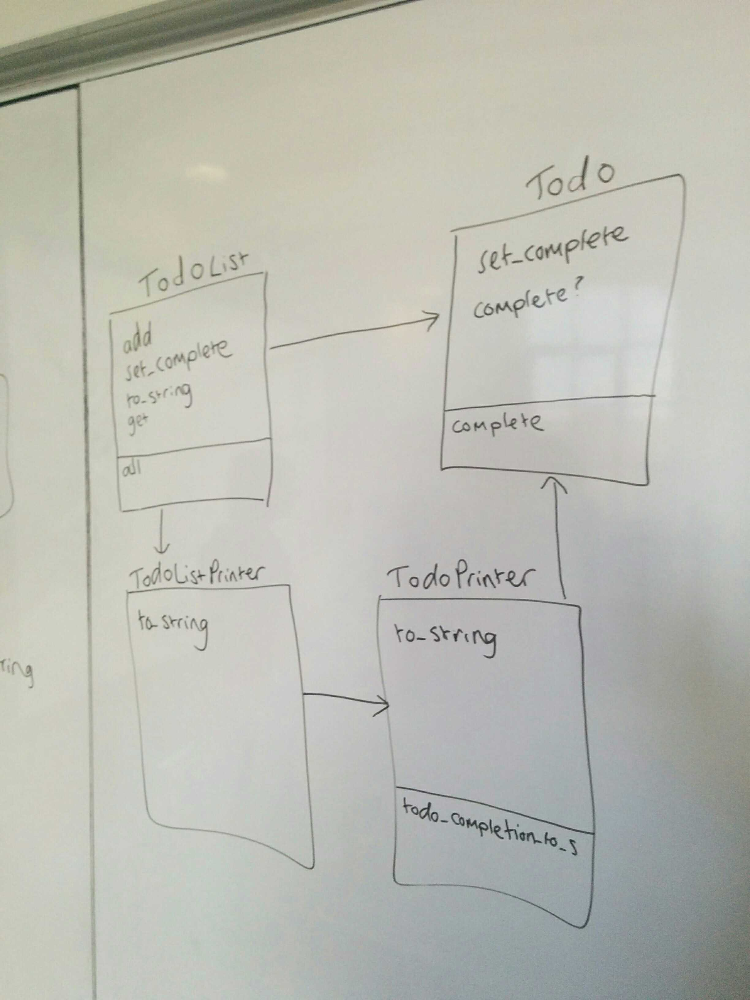
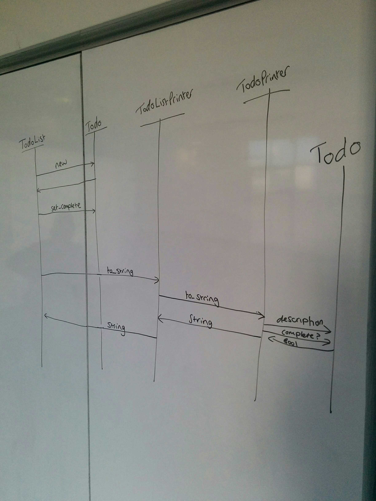

# Delegation workshop
*Date: Thu 14 Mar*  
*Coach: Sophie*  
[*Workshop details*](https://github.com/Hives/skills-workshops/tree/master/week-2/oop_3)

## Learning objectives

- Describe "delegation" as "one class telling another class to do something and the other class encapsulating how to do it."
- Explain what is meant by the advice "delegate, delegate, delegate".
- Implement OOP delegation.

## Kick off

### What is delegation?

When one class asks another class to do something. Important for 'SRP'

### Questions

Why inject rather than call .new?  
- so we can test in isolation
- so we can change the dependency being injected without having to rewrite
- polymorphism - when different types of objects respond to the same messages with the same type of response 
- basically there's never a reason not to inject a dependency

### The example

Sophie started by making a sequence and class diagram of the example:

## The exercise

Me and Amy got stuck becuase of some RSpec shenanigens that we didn't understand :(

## Plenary

Sophie went through the solution that's in the repo, showing how the notes app can be broken up into four classes/modules:

### Test behaviour not state

We also had a significant digression into testing behaviour not state, which was related to the problem that me and Amy had. This is something I seem to be doing totally wrong at the moment, so I should research it... Sophie said for now it will be an improvement just to keep the principle in mind.