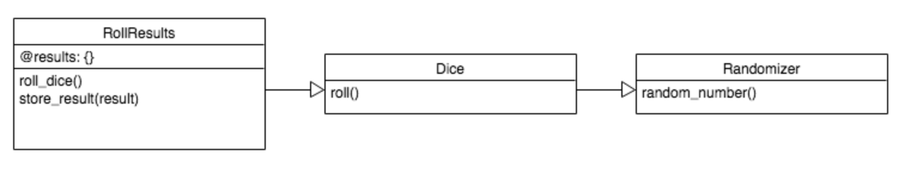

# Domain model diagramming

[Workshop repo](https://github.com/makersacademy/skills-workshops/tree/master/week-2/domain_model_diagramming)

## Qs before we started

### UML has a lot of models - which are most important?

[Introduction to Unified Modelling Language](https://www.ibm.com/developerworks/rational/library/769.html)

Sophie gave the example of a **use case diagram** -  they may be useful for some people, but she's never been able to understand them. The point being - this stuff is about communicating ideas, so different tools may be appropriate depending on what you're communicating, the domain you're dealing with, and whos doing the communicating.

Today we're looking at [**sequence diagrams**](https://www.ibm.com/developerworks/rational/library/769.html), but this would be too technical to show to a client. For users it might be better to use a [**use case diagram**](https://www.ibm.com/developerworks/rational/library/769.html).

Sophie says [**activity diagrams**](https://www.ibm.com/developerworks/rational/library/769.html) can be useful too.

But the important thing is to choose the right tool for the job.

### What tools are there for diagramming?

- Pen and paper!
- Whiteboard (take photos after if you need)
- Free, powerful online tool: <https://www.draw.io/>. probably better to sketch stuff out on paper/whiteboard before you get to this though.

### How complex should our models be?

Try to keep them as simple as possible while still capturing the important information.

If your diagram is getting too complicated it probably means you need to break your domain up.

## Here we go

### Sequence diagram

Thinks about messages which are **sent** by objects. Note that reading from left to right, 'flip' appears before 'Coin', but flip is a method being called *on* 'Coin', *by* 'HeadCount'.

The user is not included in a sequence diagram. It only diagrams the domain's internal behaviour.

### Class diagram

Thinks about messages which are **received** by objects.

### Where to start?

At this point someone asked 'which of these would you start with?'
- Good plance to start is the thing that is not included in these diagrams - the user interaction.
- Apart from that, the different diagrams complement each other so you might use both.
- But don't mix up the conventions of the different diagrams - the differnet boxes are specific to different diagram types and it will be confusing if you use the wrong one.

