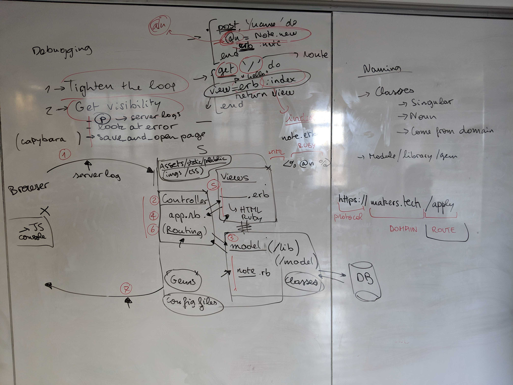

# Debugging 2 (web vybez)
*Date: Wed 20 Mar*  
*Coach: Alice*  
*[Exercise details](https://github.com/makersacademy/skills-workshops/tree/master/week-3/debugging_2)*

## Debugging mantra

1. Get visibility
2. Tighten the loop

## Debugging web apps

Working with web apps we now have more components to get bugs in.

On the server:
- Views
  - ____.erb, mixture of HTML and Ruby (and more?)
- Controller
  - app.rb, Ruby
- Model
  - player.rb, Ruby
- Gems
- Config files

On the client:
- Javascript (but not for us yet)

## Understanding your program flow

To tighten the loop you will need to understand your program flow. It's more complicated with a web app than the ruby programs we've been writing previously:

1. Client makes a HTTP request
2. Controller interprets the HTTP request
3. Controller maybe does something with the model...
4. Controller does something like `erb :index`, passing a view (`index.erb`) to the `erb` method
5. The view gets evaluated by `erb` into returning HTML
6. The output of the the view returns to the controller
7. The controller sends an HTTP response back to the client

## Getting visibility

### \`p\` out stuff, same as before

You can `p` out stuff from your program wherever you've got Ruby code, including inside `<%= some_ruby %>` tags. Output of `p` will appear in the server logs. 

### HTTP status codes

This will tell you about what's going on with the HTTP response:

- 2xx - mostly OK
- 3xx - redirection
- 4xx - bad request
- 5xx - server problem

### \`save_and_open_page\` (Capybara)

`save_and_open` page is a Capybara command which will stop your test and open the page in a browser, so you can see what's going on at that point.

### HTTP request

The HTTP request should appear in your error message, also potentially useful.