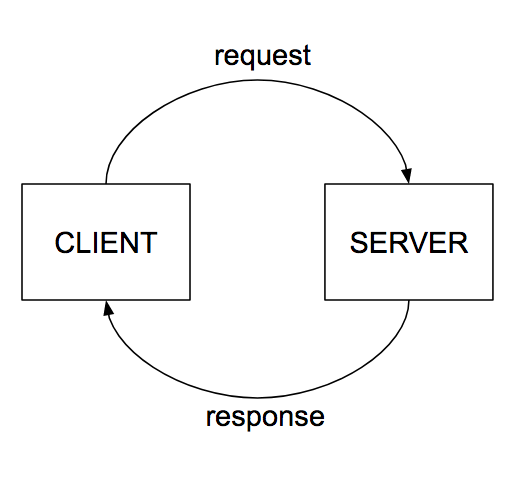
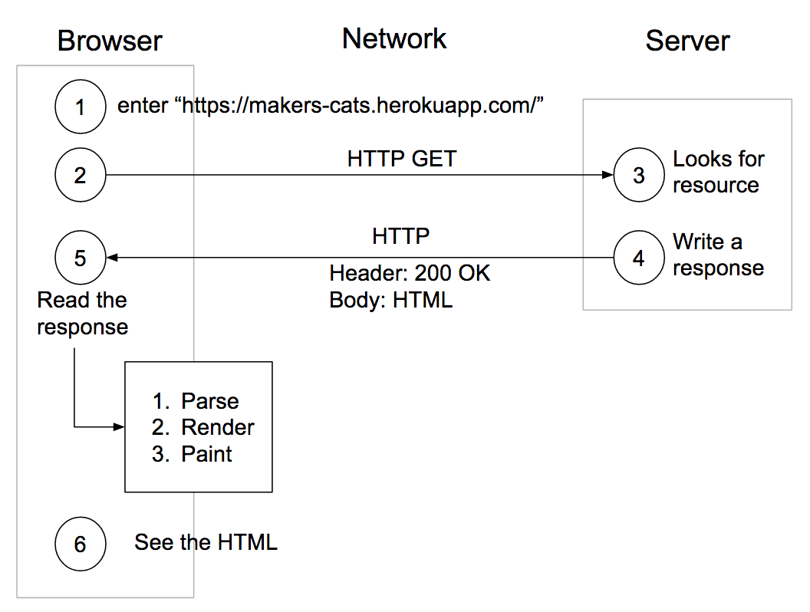

# Process modelling, applied to HTTP request/response cycle.
*Tue 19 Mar*  
*Coach: Alice*  
*[Workshop details](https://github.com/makersacademy/skills-workshops/tree/master/week-3/process_modelling)*

This mostly applies to week 3's goal **explain how the web works** and also but less so to the goal **follow an effective debugging process for the web** because the more you understand the easier that will be.

## HTTP request cycle

**Client:** a program that accesses resources on the web, e.g. a web browser, a lot of apps, uh, a web-enabled fridge. Typically it will understand HTML, CSS and Javascript, that you send to it from your app on the server.

**Server:** a program that runs on a computer that holds information, listening for requests from clients, and sending back responses. This is where our code will mostly run, and also Sinatra and any other Ruby gems included in our program.

(**Data center:** a bunch of servers running on a bunch of computers)

## Process modelling

We're going to use this as a tool to explore, understand and talk about the HTTP request/response cycle.

### First exercise

Alice went throught the [first exercise](https://github.com/makersacademy/skills-workshops/tree/master/week-3/process_modelling#home-page). She used the Network tab of Chrome Developer Tools to track a complete request/response cycle, analysing the request and response headers and content.

